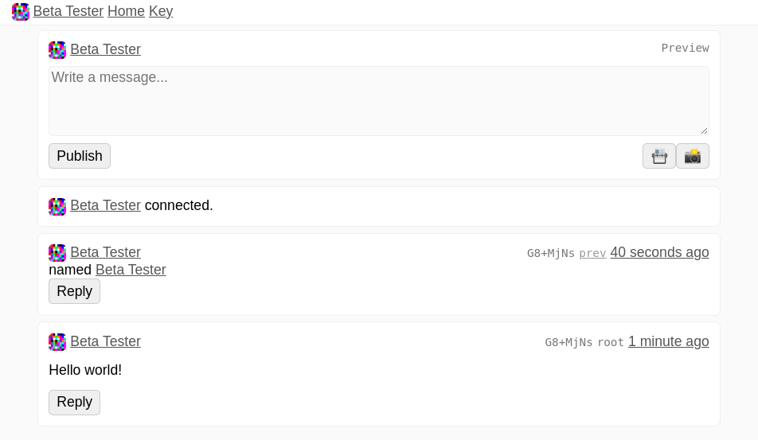

# Bogbook

### A replicated and secure social network made from ed25519 hash chains



There have been a handful of attempts at creating distributed social networks of signed messages. Many people have tried [Secure Scuttlebutt](https://scuttlebot.io), and now [Nostr](https://github.com/nostr-protocol/), and felt somewhat frustrated with the experience. 

I've been working on Bogbook since 2020, ever since walking away from creating Scuttlebutt clients. In the first version of Bogbook I tried no having any replication strategy at all, similar to how Nostr now works, and I discovered that there was no way to communicate to peers which posts I wanted to replicate into my client, which lead many unnecessary network calls. Next, I implemented an append-only log similar to SSB, but I found the initial sync experience took too long as you had to wait for every message from your peers to sync before seeing the latest messages. 

In this latest version of Bogbook (v3) I'm attaching the hash of the previous post to every message, so you can sync backwards from the latest message until you reach the first message. This means you can begin interacting immediately, and there is no need for peers to send requests for data that you already have in the client.

Bogbook always creates data first in the web browser, saving it in a local cache. Next it reaches out to a relay hosted at [Deno Deploy](https://deno.com/deploy) and that relay sends your posts to peers. Periodically your client will reach out for new posts from the pubkeys you are following. 

In Bogbook your posts are self-authenticating using a ed25519 signing key, which means that they can exist on all of the peers without any centralized or federated point of failure. To authenticate a post you open a signed message and then request the hash of the blob associated with the post.

If you are replying to someone or referencing a post all of that is included within text of the post, so your client can look those items up simply by reading the post and looking for any links that are 44 characters long, so there are no weird JSON schemas to remember when you are implementing a client.

This is not just theoretical, you can try it right now at https://bogbook.com/ just choose a key, give yourself a name, and you are an active participant on the network.

### Get started

Get yourself a copy of the [Deno](https://deno.land/) JavaScript runtime.

```
deno run --allow-all --unstable relay.js
```

and navigate to http://localhost:8080

Generate a keypair, and then post a message!

And if you want to see the message replicate to another bogbook client, then open up 

http://127.0.0.1:8080/ 

create another keypair and begin publishing to see the messages appear across both windows.

...

or try it online! https://bogbook.com/ or https://denobook.com/

Visit my profile pages:

+ [Ev 💻](https://bogbook.com/#ebAzm6zzxkYHdBynPlDfX9+VyKYYLGz7GIoNi9l4SJ0=)
+ [ev 📱](https://bogbook.com/#ezVThYBx5hoRMnVB1uAF+WT5t9soXvbxUqq0j8tMEZI=)

to say hello! 

### How it works

When you publish a new post it references the sha256 hash of the previous post. If this is your first post then the hash of the post and the previous hash will be identical, and that is called a "root" post. The replication algorithm will stop trying to sync posts when it reaches the root.

Posts are created in the browser client, and then replicated via relay servers. You can request the latest post from an author by sending the author's ed25519 public key to the relay, the relay will ask active peers if they have a latest post from the author or a post that has the same hash as the request. 

Once you get the latest post from the author the replication algorithm asks for the hash of the previous post until you reach a post that you already have, then it will stop asking for previous posts and your copy of the feed is up to date. 

You can fork a feed by using two devices. To merge the feed, you will want to mention your fork in the text of a new message so that people can find the head of that branch and sync backwards until the fork is resolved. The algorithm itself does not fix forked feeds, but it won't break if there is a fork. 

### The Protocol

Messages are sent around using this protocol format:

```
<ed25519 Public Key><Signature>
```

which opens to a string that contains

```
<timestamp><ed25519 Public Key><Previous Post Hash><Data Hash><Post Hash>
```

And from that we create a message object:

```
{
  timestamp: <timestamp>,
  author: <ed25519 Public Key>,
  previous: <sha256 hash from previous post>,
  data: <sha256 hash of post data>,
  hash: <sha256 hash of post (ts, author, data)>,
  raw: <timestamp><ed25519 Public Key><Previous Post Hash><Data Hash><Post Hash>
}
```

---
MIT


